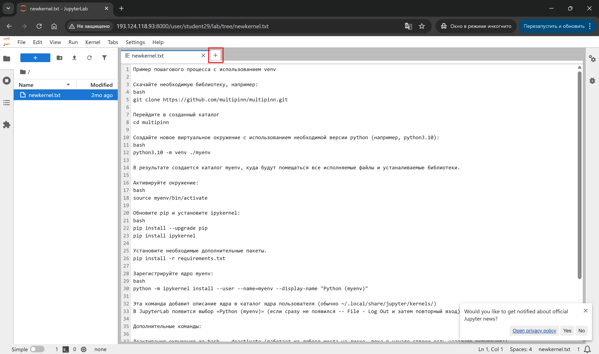
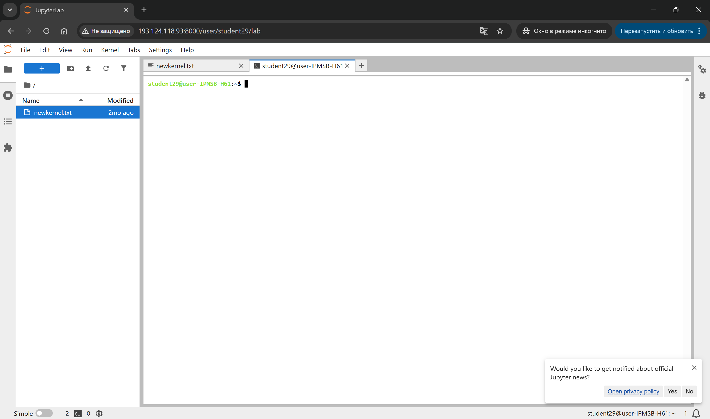
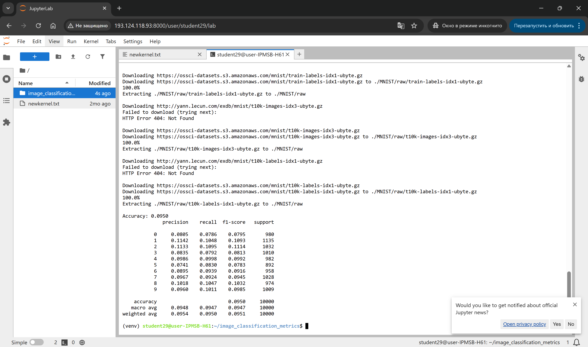
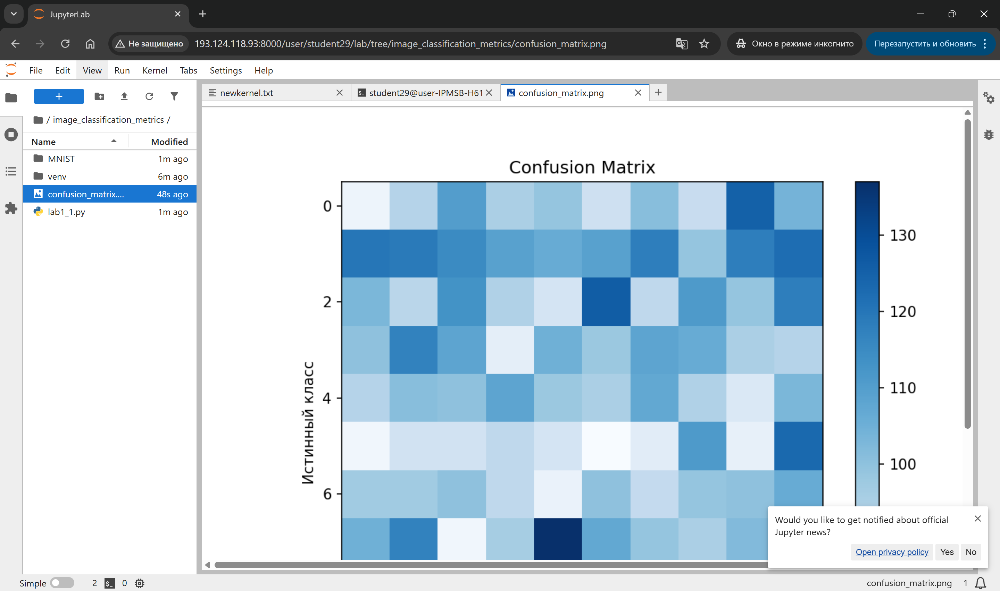

# Методические указания к практической работе №1 
**Тема:** Метрики оценки качества классификации изображений. 4 часа  

---

## 🎯 Цель работы  
Изучить ключевые метрики качества классификации изображений:  
- Confusion Matrix  
- Accuracy  
- Recall  
- Precision  
- F1-Score  

---

## 📌 Задачи  
- Изучить устройство и смысл Confusion Matrix  
- Понять метрику Accuracy  
- Изучить Recall  
- Изучить Precision  
- Рассчитать и интерпретировать F1-Score  

---

## 📁 Материалы и методы
- Язык программирования – Python 3.10.
- Основные библиотеки:
  -  [scikit-learn](https://scikit-learn.org/),
  -  [matplotlib](https://matplotlib.org/),
  -  [PyTorch (torch, torchvision)](https://pytorch.org/).
  
### 📁 Сведения о датасетах  
- [**MNIST**](https://www.kaggle.com/datasets/hojjatk/mnist-dataset): 60 000 изображений цифр (28×28), 10 классов  
- [**Fashion-MNIST**](https://www.kaggle.com/datasets/zalando-research/fashionmnist): 70 000 изображений одежды (28×28, градацие серого), 10 классов (футболки, брюки, обувь и т. д.), аналог по формату оригинального MNIST, но более сложные объекты 
- [**CIFAR-10**](https://www.kaggle.com/c/cifar-10/): 60 000 цветных изображений (32×32), 10 классов (самолёты, автомобили, птицы и т. д.), 50 000 примеров для обучения, 10 000 для теста

---

## 📚 Краткая теоретическая информация  

### Confusion Matrix  
|               | Предсказано: Положительное | Предсказано: Отрицательное |
|---------------|----------------------------|-----------------------------|
| Истинное: Положительное (TP) | TP | FN |
| Истинное: Отрицательное (TN) | FP | TN |

### Метрики  
- **Accuracy**:  
  

$$
  Accuracy = \frac{TP + TN}{TP + FP + FN + TN}
$$


- **Recall**:  
  

$$
  Recall = \frac{TP}{TP + FN}
$$


- **Precision**:  
  

$$
  Precision = \frac{TP}{TP + FP}
$$


- **F1-Score**:  
  

$$
  F1 = 2 \cdot \frac{Precision \cdot Recall}{Precision + Recall}
$$


- **ROC-кривая и AUC**

ROC-кривая (Receiver Operating Characteristic) отображает зависимость истинно-положительной доли (TPR) от ложно-положительной доли (FPR) при изменении порога решения.

TPR (чувствительность, Recall) рассчитывается как


$$
  TPR = \frac{TP}{TP + FN}
$$


FPR определяется как


$$
  FPR = \frac{FP}{FP + TN}
$$


AUC (Area Under Curve) — площадь под ROC-кривой. Значение AUC в интервале от 0.5 (случайная модель) до 1.0 (идеальная модель) отражает общее качество разделения классов независимо от порога.

- **Balanced Accuracy и Cohen’s Kappa**

Balanced Accuracy — среднее значение полноты по классам. Для бинарной классификации:


$$
  BalancedAccuracy = \frac{1}{2} \cdot ( \frac{TP}{TP + FN} + \frac{TN}{TN + FP} )
$$


Cohen’s Kappa измеряет согласие предсказаний и истинных меток с поправкой на случайное совпадение:


$$
  k = \frac{p_{0} - p_{e}}{1 - p_{e}},
$$


где p<sub>0</sub> -- наблюдаемая точность (Accuracy), а p<sub>e</sub> -- ожидаемая точность при случайном угадывании.

---

## 🌳 Основные алгоритмы
1. [**SVM (Support Vector Machine)**](https://scikit-learn.org/stable/modules/svm.html):
- Максимизирует отступ между классами
- Поддерживает ядра (линейное, RBF и др.)
2. [**RandomForest**](https://scikit-learn.org/stable/modules/generated/sklearn.ensemble.RandomForestClassifier.html):
- Ансамбль из множества деревьев решений
- Усредняет предсказания для устойчивости к переобучению
3. [**Простейшая CNN (Convolutional Neural Network)**](https://www.datacamp.com/tutorial/pytorch-cnn-tutorial):
- Слой свёртки + ReLU + пулинг
- Несколько таких блоков + полносвязный слой
- В PyTorch: *torch.nn.Conv2d*, *torch.nn.MaxPool2d*, *torch.nn.Linear* 

## ⚙️ Настройка среды  

### Авторизоваться на сервере [Jupyter-Hub](https://jupyter.org/hub) по адресу [Jupyter-Hub-ИИСТ-НПИ](http://195.133.13.56:8000/)


### Создать новую вкладку символом **+**



### Выбрать тип новой вкладки -- Terminal 


### Работать в новой вкладке вида




### Ввести последовательно (каждую строку отдельно):

```bash
mkdir image_classification_metrics
cd image_classification_metrics
python3.10 -m venv venv
source venv/bin/activate
pip install --upgrade pip
pip install torch torchvision --index-url https://download.pytorch.org/whl/cpu
pip install scikit-learn matplotlib
```

---
## 🧪 Примеры

### 🧪 Простейший пример со случайными метками на изображениях
Создать файл из командной строки с использованием текстового редактора *nano*

```bash

nano lab1_1.py
```

Вставить текст:

```python
#!/usr/bin/env python3
import torch
from torchvision import datasets, transforms
from torch.utils.data import DataLoader
from sklearn.metrics import confusion_matrix, classification_report, accuracy_score
import matplotlib.pyplot as plt
import numpy as np

# 1. Загрузка MNIST
transform = transforms.Compose([transforms.ToTensor()])
train_ds = datasets.MNIST('.', download=True, train=False, transform=transform)
loader = DataLoader(train_ds, batch_size=256, shuffle=False)

# 2. Простая модель: случайные метки
y_true, y_pred = [], []
for images, labels in loader:
    y_true.extend(labels.numpy())
    # Имитируем предсказания случайным образом
    y_pred.extend(np.random.randint(0, 10, size=labels.shape))

y_true = np.array(y_true)
y_pred = np.array(y_pred)

# 3. Расчёт метрик
acc = accuracy_score(y_true, y_pred)
report = classification_report(y_true, y_pred, digits=4)
cm = confusion_matrix(y_true, y_pred)

print(f"Accuracy: {acc:.4f}")
print(report)

# 4. Визуализация матрицы ошибок
plt.figure(figsize=(8, 6))
plt.imshow(cm, interpolation='nearest', cmap='Blues')
plt.title("Confusion Matrix")
plt.colorbar()
plt.xlabel("Предсказанный класс")
plt.ylabel("Истинный класс")
plt.savefig("confusion_matrix.png", dpi=150)
```

Сохранить текст `Ctrl+X` - `Enter` и выйти из редактора *nano* `Ctrl+O`

Запуск из командной строки:

```bash

python3 lab1_1.py

```

Убедиться в создании файлов с изображением Confusion Matrix. Это можно сделать, используя правую часть окна:
- Двойным нажатие на имени каталога переходим в каталог `image_classification_metrics`



- Открываем файл `confusion_matrix.png` двойным нажатием




### 📌 Задание для самостоятельной работы #1
1. Заменить генерацию случайных меток на простую модель, например, логистическую регрессию из sklearn.linear_model.LogisticRegression на признаках, полученных из изображений (развёрнутый в вектор 784-х).
2. Пересчитать и визуализировать метрики для полученной модели.

```python
# Заготовка для самостоятельного задания
from sklearn.linear_model import LogisticRegression

# ... загрузка данных и разворачивание изображений ...
model = LogisticRegression(max_iter=200)
model.fit(X_train, y_train)
y_pred = model.predict(X_test)

# рассчитать и вывести метрики
```


### 🧪 Пример 2. SVM + CIFAR-10 + ROC-кривая и AUC

Создать и запустить файл `lab1_2.py` со следующим содержимым:

```python
#!/usr/bin/env python3
import numpy as np
from sklearn.svm import SVC
from sklearn.metrics import roc_curve, auc
from sklearn.preprocessing import label_binarize
from torchvision.datasets import CIFAR10
from torchvision.transforms import ToTensor

# Загрузка CIFAR-10
ds = CIFAR10('.', train=False, download=True, transform=ToTensor())
X = np.array([img.numpy().reshape(-1) for img, _ in ds])
y = np.array([label for _, label in ds])

# Бинаризация меток (One-vs-Rest)
y_bin = label_binarize(y, classes=range(10))

# Обучение SVM с вероятностными предсказаниями
model = SVC(kernel='linear', probability=True, random_state=42)
model.fit(X, y)

# Для одного класса (например, класс 0)
probs = model.predict_proba(X)[:, 0]
fpr, tpr, _ = roc_curve(y_bin[:, 0], probs)
roc_auc = auc(fpr, tpr)

# Сохранение графика
import matplotlib.pyplot as plt
plt.figure()
plt.plot(fpr, tpr, label=f'AUC = {roc_auc:.3f}')
plt.plot([0,1], [0,1], 'k--')
plt.xlabel('FPR')
plt.ylabel('TPR')
plt.title('ROC-кривая для класса 0')
plt.legend(loc='lower right')
plt.savefig('svm_cifar10_roc.png', dpi=150)
```

Убедиться в наличии и корректности результатов в виде графика.


### 📌 Задание для самостоятельной работы #2
1. Постройте ROC-кривые и вычислите AUC для трёх выбранных классов CIFAR-10.
2. Сравните, какие классы модель отделяет лучше всего.


### 🧪 Пример 3. RandomForest + Fashion-MNIST + Balanced Accuracy и Cohen’s Kappa

Создать и запустить файл `lab1_3.py` со следующим содержимым:

```python
#!/usr/bin/env python3
import numpy as np
from sklearn.ensemble import RandomForestClassifier
from sklearn.metrics import balanced_accuracy_score, cohen_kappa_score
from torchvision.datasets import FashionMNIST
from torchvision.transforms import ToTensor

# Загрузка Fashion-MNIST
ds = FashionMNIST('.', train=False, download=True, transform=ToTensor())
X = np.array([img.numpy().reshape(-1) for img, _ in ds])
y = np.array([label for _, label in ds])

# Обучение случайного леса
rf = RandomForestClassifier(n_estimators=100, random_state=0)
rf.fit(X, y)
y_pred = rf.predict(X)

# Метрики
bal_acc = balanced_accuracy_score(y, y_pred)
kappa = cohen_kappa_score(y, y_pred)
print(f"Balanced Accuracy: {bal_acc:.4f}")
print(f"Cohen's Kappa: {kappa:.4f}")
```


### 📌 Задание для самостоятельной работы #3
1. Измените число деревьев (n_{estimators}) и сравните, как меняются Balanced Accuracy и κ.
2. Оцените, при каком количестве деревьев достигается оптимальный баланс метрик.


### 🧪 Пример 4. Простая CNN + CIFAR-10 + весь набор метрик

Создать и запустить файл `lab1_4.py` со следующим содержимым:

```python
#!/usr/bin/env python3
import torch
import torch.nn as nn
import torch.optim as optim
from torch.utils.data import DataLoader
from torchvision import transforms, datasets
import numpy as np
from sklearn.metrics import (
    confusion_matrix, accuracy_score,
    precision_recall_fscore_support,
    balanced_accuracy_score, cohen_kappa_score,
    roc_curve, auc
)
import matplotlib.pyplot as plt

# 1. Сеть
class SimpleCNN(nn.Module):
    def __init__(self):
        super().__init__()
        self.conv_block = nn.Sequential(
            nn.Conv2d(3, 16, 3, padding=1), nn.ReLU(),
            nn.MaxPool2d(2),
            nn.Conv2d(16, 32, 3, padding=1), nn.ReLU(),
            nn.MaxPool2d(2)
        )
        self.fc = nn.Linear(32*8*8, 10)
    def forward(self, x):
        x = self.conv_block(x)
        x = x.view(x.size(0), -1)
        return self.fc(x)

# 2. Данные
transform = transforms.Compose([transforms.ToTensor()])
train_ds = datasets.CIFAR10('.', train=True, download=True, transform=transform)
test_ds  = datasets.CIFAR10('.', train=False, download=False, transform=transform)
train_loader = DataLoader(train_ds, batch_size=128, shuffle=True)
test_loader  = DataLoader(test_ds,  batch_size=256, shuffle=False)

# 3. Обучение (2 эпохи для примера)
device = torch.device('cuda' if torch.cuda.is_available() else 'cpu')
model = SimpleCNN()
model.to(device)
criterion = nn.CrossEntropyLoss()
opt = optim.Adam(model.parameters(), lr=1e-3)
num_epochs = 3
for epoch in range(num_epochs):
  model.train()
  running_loss = 0.0
  for imgs, labels in train_loader:
      imgs, labels = imgs.to(device), labels.to(device)
      pred = model(imgs)
      loss = criterion(pred, labels)
      opt.zero_grad(); loss.backward(); opt.step()
      running_loss += loss.item()
  avg_loss = running_loss / len(train_loader)
  print(f"Epoch {epoch+1}/{num_epochs} — Loss: {avg_loss:.4f}")

# 4. Тестирование и сбор предсказаний
model.eval()
y_true, y_pred, y_prob = [], [], []
with torch.no_grad():
    for imgs, labels in test_loader:
        imgs = imgs.to(device)
        logits = model(imgs)
        probs = nn.Softmax(dim=1)(logits).cpu().numpy()
        pred  = np.argmax(probs, axis=1)
        y_true.extend(labels.numpy())
        y_pred.extend(pred)
        y_prob.extend(probs)

y_true = np.array(y_true)
y_pred = np.array(y_pred)
y_prob = np.array(y_prob)

# 5. Классические метрики
acc   = accuracy_score(y_true, y_pred)
prec, rec, f1, _ = precision_recall_fscore_support(y_true, y_pred, average='macro')
bal_acc = balanced_accuracy_score(y_true, y_pred)
kappa   = cohen_kappa_score(y_true, y_pred)

print(f"Accuracy: {acc:.4f}")
print(f"Precision: {prec:.4f}, Recall: {rec:.4f}, F1-Score: {f1:.4f}")
print(f"Balanced Accuracy: {bal_acc:.4f}")
print(f"Cohen's Kappa: {kappa:.4f}")

# 6. Матрица ошибок
cm = confusion_matrix(y_true, y_pred)
plt.imshow(cm, cmap='Blues')
plt.title("Confusion Matrix")
plt.colorbar()
plt.savefig("cnn_cifar10_cm.png", dpi=150)

# 7. ROC и AUC для трёх классов
plt.clf()       # Очистить текущую фигуру
plt.close()     # Закрыть текущую фигуру
for cls in [0,1,2]:
    fpr, tpr, _ = roc_curve((y_true==cls).astype(int), y_prob[:,cls])
    roc_auc = auc(fpr, tpr)
    plt.plot(fpr, tpr, label=f"Class {cls} (AUC={roc_auc:.2f})")
plt.plot([0,1],[0,1],'k--')
plt.xlabel("FPR"); plt.ylabel("TPR")
plt.title("ROC for CNN")
plt.legend()
plt.savefig("cnn_cifar10_roc_all.png", dpi=150)
```

Убедиться в наличии и корректности результатов в виде графика.


### 📌 Задание для самостоятельной работы #4
1. Добавьте вторую эпоху обучения и сравните, как изменятся все метрики.
2. Измените архитектуру CNN (добавьте сверточный слой или плотный слой) и оцените влияние на AUC, κ и другие показатели.

---

## 💡 Не забудьте выключить текущую среду выполнения программы python (должна пропасть надпись (venv) в начале командной строки):

```bash

deactivate

```

---
## Вопросы
1. Как структура матрицы ошибок помогает выявить типичные ошибки модели?
2. В каких случаях метрику Accuracy использовать нельзя?
3. Как соотносятся Precision и Recall при сильном дисбалансе классов?
4. Почему F1-Score может быть предпочтительнее Accuracy?
5. Что показывает форма “горячей” (тепловой) карты матрицы ошибок?
6. Как изменится оценка качества при изменении порога классификации?
7. Какие ещё метрики стоит изучить для многоклассовой классификации?
8. Какие метрики оказались наиболее чувствительными к добавлению эпох/слоев в CNN?
9. Почему AUC может расти при небольшом повышении Accuracy?
10. В каких случаях Balanced Accuracy предпочтительнее обычной Accuracy?
11. Как влияет настройка probability=True в SVM на расчёт ROC?
12. Что показывает значение κ близкое к нулю, а что — близкое к единице?
13. Какие приёмы можно использовать для повышения Recall без значительного падения Precision?
14. Какие ещё модели и датасеты было бы интересно исследовать, чтобы расширить практику работы с метриками?

