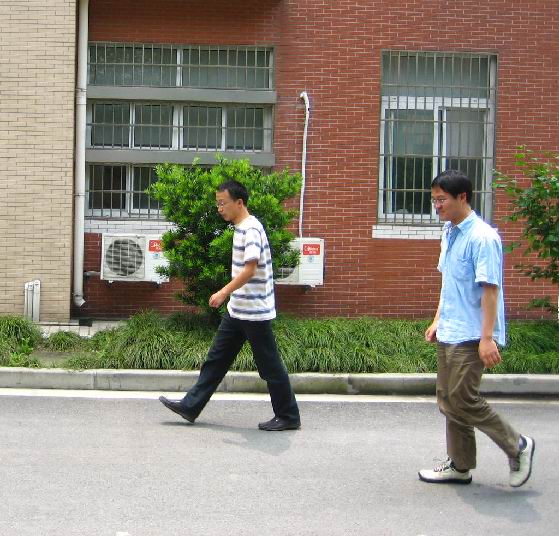
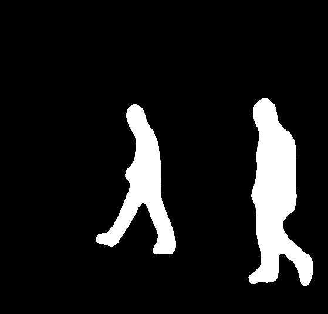

# Методические указания к практической работе №2 
**Тема:** Метрики оценки качества сегментации и детекции изображений. 4 часа  

---

## 🎯 Цель работы  
Изучить метрики оценки качества решения задачи «Сегментация и Детекция».

---

## 📌 Задачи  
- Изучить Intersection over Union (IoU). 
- Изучить mean Average Precision (mAP).  
- Изучить Dice Coefficient.

---

## 📁 Материалы и методы
- Язык программирования – Python 3.10.
- Основные библиотеки:
  -  [scikit-learn](https://scikit-learn.org/),
  -  [matplotlib](https://matplotlib.org/),
  -  [PyTorch (torch, torchvision)](https://pytorch.org/),
  -  [pydensecrf](https://github.com/lucasb-eyer/pydensecrf.git).
- Датасет – [Penn-Fudan Pedestrian Detection and Segmentation (170 изображений).](https://www.kaggle.com/datasets/psvishnu/pennfudan-database-for-pedestrian-detection-zip)

Датасет Penn-Fudan Dataset содержит 170 цветных изображений пешеходов и соответствующие маски сегментации (PNG) и аннотации прямоугольных рамок (PNG).

Каталог:

```code
PennFudanPed/
├── PNGImages/
│   ├── FudanPed00001.png
│   └── ...
└── PedMasks/
    ├── FudanPed00001_mask.png
    └── ...
```
---

## 📚 Краткая теоретическая информация  

### 📚 Сегментация

Сегментация — это процесс разделения изображения на однородные области (сегменты), каждая из которых соответствует конкретному объекту или фону.

В задаче семантической сегментации каждому пикселю присваивается категория (например, «пешеход», «дорога», «здания»).

В детекции мы работаем с ограничивающими рамками, а в сегментации нужно точно очертить форму объекта.

### 📚 Основные подходы к сегментации

1. Классические методы обработки изображений
- Пороговая сегментация (Thresholding): разделение по интенсивности яркости.
- Алгоритмы кластеризации (например, k-means): группировка пикселей по цвету или текстуре.
- Графовые методы (Graph Cut, GrabCut): минимизация энергию разметки за счёт графовых разрезов.
2. Глубокие нейронные сети
- Fully Convolutional Network (FCN): свёрточная сеть без полносвязных слоёв, выдаёт карту классов на уровне пикселей.
- U-Net: инновационная архитектура с «скачками» между кодировщиком и декодировщиком для точного восстановления границ.
- DeepLab (v3+): использует атрибутивные свёртки (atrous convolution) и пространственные пирамидальные пулы (ASPP) для захвата контекста.

### 📚 Этапы работы нейросетевой сегментации
1. Подготовка данных
- Маски с разметкой каждого пикселя по классам.
- Аугментации для устойчивости модели (повороты, масштаб, сдвиги).
2. Обучение модели
- Функция потерь обычно сочетает кросс-энтропию и дополнительные термы (Dice, IoU-loss).
- Оптимизация с помощью стохастического градиентного спуска или его модификаций (Adam, SGD с моментумом).
3. Инференс и пост-обработка
- Прямое предсказание карты классов для всех пикселей.
- Сглаживание границ (CRF, морфологические операции) для устранения «шумов» на краях.

### 📚 Варианты сегментации и их особенности

| Тип сегментации | Задача | Особенности |
|-----------------|----------------|-----------------------------|
| Семантическая | Разметка пикселей по классам | Не разделяет разные экземпляры одного класса |
| Instance Segmention | Выделение каждого объекта как отдельного | Нужны дополнительные головы предсказания маски |
| Panoptic Segmentation | Комбинация семантики и инстансов | Покрывает все пиксели и различает объекты и фон |

Глубже понять сегментацию можно изучив:
- Трансформеры в сегментации ([SegFormer](SegFormer), [SETR](https://github.com/fudan-zvg/SETR)).
- [Слабонаправленную сегментацию без пиксельной разметки](https://arxiv.org/html/2310.13026v2).
- Использование самосупервизии и контрастного обучения для предварительного обучения на неразмеченных данных.

### 📚 Теоретическая информация о метриках

Intersection over Union (IoU) – отношение площади пересечения предсказанной области и истинной области к площади их объединения.

mean Average Precision (mAP) – усреднённая площадь под кривой Precision–Recall по всем классам или по разным порогам IoU.

Dice Coefficient – мера сходства двух бинарных масок:

$$
  Dice = 2 \cdot \frac{|A \cap B|}{|A| + |B|}
$$

## ⚙️ Настройка среды

0. Подключитесь к [Jupyter-Hub-ИИСТ-НПИ](http://195.133.13.56:8000/) из [предыдущей работы](docs/lab_1_cv_metrics.md#%EF%B8%8F-настройка-среды)
1. Создайте в корне домашнего каталога каталог проекта и перейдите в него:
```bash

mkdir segmentation_detection_lab
cd segmentation_detection_lab

```
2. Создайте и активируйте виртуальное окружение:
```bash

python3.10 -m venv venv
source venv/bin/activate

```

3. Установите зависимости:
```bash

pip install --upgrade pip setuptools wheel cython
pip install torch torchvision --index-url https://download.pytorch.org/whl/cpu
pip install scikit-learn matplotlib numpy opencv-python segmentation-models-pytorch efficientnet_pytorch
export CPLUS_INCLUDE_PATH=/usr/include/eigen3:$CPLUS_INCLUDE_PATH
git clone https://github.com/lucasb-eyer/pydensecrf.git
cd pydensecrf
pip install .
cd ..

```

## 🧪 Примеры и задания 

### 🧪 Простейшая сегментация. Повторять данные шаги не требуется!

**Данный пример приведен для изучения. Он выполняет сегментацию и размещает результаты в общедоступном каталоге /home/jupyter/segmentation_detection_lab/data/PennFudanPed/. Одного выполнения (уже сделано) достаточно. Есть есть желание его повторить, то сначала нужно создать `evaluate_metrics.py` (показан под осоновным текстом), а затем уже запускать предсказание**

**Описание примера**
В простейшей демонстрационной программе сегментация реализована не на нейросетях, а моделируется простым морфологическим приёмом — дилатацией (расширением) исходной “идеальной” маски.

Как работает программа

1. Загрузка эталонной маски. Для каждого изображения читается файл маски из папки PedMasks:
```python
mask_gt = cv2.imread(ds.masks[idx], cv2.IMREAD_GRAYSCALE) > 0
```

Здесь `mask_gt` — булева матрица, где True означает пиксель объекта.

2. Генерация предсказанной маски. Скрипт можно назвать `run_inference.py`
```python
#!/usr/bin/env python3
import os
import json
import cv2
import numpy as np
import torch
from torchvision import transforms as T
from torchvision.models.detection import maskrcnn_resnet50_fpn
from evaluate_metrics import PennFudanDataset  # ваш класс из evaluate_metrics.py

def main(data_root, pred_mask_dir, pred_boxes_path, device="cpu"):
    # 1) Подготовка
    os.makedirs(pred_mask_dir, exist_ok=True)
    ds = PennFudanDataset(root=data_root)
    model = maskrcnn_resnet50_fpn(pretrained=True).to(device).eval()
    transform = T.Compose([T.ToTensor()])

    pred_boxes = {}

    for idx in range(len(ds)):
        img, _ = ds[idx]                          # img — numpy RGB
        img_t = transform(img).to(device).unsqueeze(0)

        # 2) Инференс
        with torch.no_grad():
            out = model(img_t)[0]

        boxes  = out["boxes"].cpu().numpy().tolist()
        scores = out["scores"].cpu().numpy().tolist()

        # 3) Собираем union-маску всех инстансов
        masks = (out["masks"].cpu().numpy() > 0.5).squeeze(1)  # (N,H,W)
        if masks.ndim == 2:  # если всего один объект
            union = masks.astype(np.uint8)
        else:
            union = np.any(masks, axis=0).astype(np.uint8)

        # 4) Сохраняем маску как PNG (0 или 255)
        mask_name = os.path.basename(ds.mask_paths[idx])
        mask_out  = (union * 255).astype(np.uint8)
        cv2.imwrite(os.path.join(pred_mask_dir, mask_name), mask_out)

        # 5) Заполняем словарь для JSON
        pred_boxes[str(idx)] = {
            "boxes":  boxes,
            "scores": scores
        }

    # 6) Сохраняем JSON
    with open(pred_boxes_path, "w") as f:
        json.dump(pred_boxes, f, indent=2)
    print("Inference done.")

if __name__ == "__main__":
    import argparse
    p = argparse.ArgumentParser()
    p.add_argument("--data-root",       required=True,
                   help="Путь к PennFudanPed")
    p.add_argument("--pred-mask-dir",   required=True,
                   help="Куда сохранить предсказанные маски")
    p.add_argument("--pred-boxes-json", required=True,
                   help="Куда сохранить предсказанные боксы (JSON)")
    args = p.parse_args()

    main(args.data_root, args.pred_mask_dir, args.pred_boxes_json)

```
Его запуск осуществлен от имени пользователя `jupyter` следующим образом:

```bash

python run_inference.py \
  --data-root       ./data/PennFudanPed \
  --pred-mask-dir   ./data/PennFudanPed/pred_masks \
  --pred-boxes-json ./data/PennFudanPed/pred_boxes.json
```
После этого в каталоге `/home/jupyter/segmentation_detection_lab/data/PennFudanPed/pred_masks` были созданы PNG-маски:
   
   

а в `pred_boxes.json` — структура

```json

{
  "0": { "boxes": [[x1,y1,x2,y2],...], "scores": [s1, s2, ...] },
  "1": { ... }
}

```

3. Вычисление метрик. На основе `mask_gt` и `mask_pred` рассчитываются:
- Dice Coefficient — мера перекрытия двух бинарных областей
- IoU прямоугольных рамок, полученных из масок (bounding boxes)
- Precision–Recall на основе IoU как “оценки достоверности” детекции

Код примера, подготовливающего сегментацию `evaluate_metrics.py`:

```python
#!/usr/bin/env python3
# -*- coding: utf-8 -*-

import os
import argparse
import json
import cv2
import numpy as np
import torch
from torch.utils.data import Dataset


class PennFudanDataset(Dataset):
    """
    Простой Dataset для Penn-Fudan Pedestrian
    Ожидает структуру:
      root/PNGImages   — rgb .png
      root/PedMasks    — .png-маски
    При инициализации self.img_paths и self.mask_paths
    содержат полные пути к файлам.
    """
    def __init__(self, root, transforms=None):
        self.root = root
        self.transforms = transforms

        img_dir  = os.path.join(root, "PNGImages")
        mask_dir = os.path.join(root, "PedMasks")

        # берём только файлы с .png и пропускаем всё остальное
        imgs = sorted([
            fname for fname in os.listdir(img_dir)
            if fname.lower().endswith(".png")
               and os.path.isfile(os.path.join(img_dir,  fname))
        ])
        masks = sorted([
            fname for fname in os.listdir(mask_dir)
            if fname.lower().endswith(".png")
               and os.path.isfile(os.path.join(mask_dir, fname))
        ])

        self.img_paths  = [os.path.join(img_dir,  f) for f in imgs]
        self.mask_paths = [os.path.join(mask_dir, f) for f in masks]

    def __len__(self):
        return len(self.img_paths)

    def __getitem__(self, idx):
        # Загружаем RGB-изображение
        img_path = self.img_paths[idx]
        img_bgr  = cv2.imread(img_path)
        if img_bgr is None:
            raise FileNotFoundError(f"Image not found or unreadable: {img_path}")
        img      = cv2.cvtColor(img_bgr, cv2.COLOR_BGR2RGB)

        # Загружаем маску
        mask_path = self.mask_paths[idx]
        mask_gray = cv2.imread(mask_path, cv2.IMREAD_GRAYSCALE)
        mask      = np.array(mask_gray, dtype=np.uint8)

        # Выделяем ID объектов (0 — фон)
        obj_ids = np.unique(mask)
        obj_ids = obj_ids[obj_ids != 0]

        # Бинарные маски для каждого объекта (N, H, W)
        masks = mask[None, ...] == obj_ids[:, None, None]

        # Коробки [xmin, ymin, xmax, ymax]
        boxes = []
        for m in masks:
            ys, xs = np.where(m)
            boxes.append([int(xs.min()), int(ys.min()), int(xs.max()), int(ys.max())])
        boxes = torch.as_tensor(boxes, dtype=torch.float32)

        labels   = torch.ones((len(boxes),), dtype=torch.int64)
        masks    = torch.as_tensor(masks, dtype=torch.uint8)
        image_id = torch.tensor([idx])
        area     = (boxes[:, 3] - boxes[:, 1]) * (boxes[:, 2] - boxes[:, 0])
        iscrowd  = torch.zeros((len(boxes),), dtype=torch.int64)

        target = {
            "boxes": boxes,
            "labels": labels,
            "masks": masks,
            "image_id": image_id,
            "area": area,
            "iscrowd": iscrowd
        }

        if self.transforms:
            img = self.transforms(img)

        return img, target


def compute_mask_iou(pred_mask: np.ndarray, gt_mask: np.ndarray) -> float:
    inter = np.logical_and(pred_mask, gt_mask).sum()
    union = np.logical_or(pred_mask, gt_mask).sum()
    if union == 0:
        return 1.0 if inter == 0 else 0.0
    return float(inter) / union


def compute_mask_dice(pred_mask: np.ndarray, gt_mask: np.ndarray) -> float:
    inter = np.logical_and(pred_mask, gt_mask).sum()
    total = pred_mask.sum() + gt_mask.sum()
    if total == 0:
        return 1.0 if inter == 0 else 0.0
    return 2.0 * inter / total


def compute_box_iou(boxA, boxB):
    xA = max(boxA[0], boxB[0])
    yA = max(boxA[1], boxB[1])
    xB = min(boxA[2], boxB[2])
    yB = min(boxA[3], boxB[3])

    interW = max(0, xB - xA + 1)
    interH = max(0, yB - yA + 1)
    inter  = interW * interH

    areaA = (boxA[2] - boxA[0] + 1) * (boxA[3] - boxA[1] + 1)
    areaB = (boxB[2] - boxB[0] + 1) * (boxB[3] - boxB[1] + 1)
    union = areaA + areaB - inter

    if union == 0:
        return 0.0
    return inter / union


def compute_map(predictions, ground_truths, iou_threshold=0.5):
    """
    mAP (11-point interpolation) для одного класса.
    predictions: список {"image_id": int, "boxes": [[...]], "scores": [...]}
    ground_truths: dict image_id -> list of gt boxes
    """
    all_preds = []
    total_gts = 0

    for item in predictions:
        img_id = item["image_id"]
        for b, s in zip(item["boxes"], item["scores"]):
            all_preds.append({"image_id": img_id, "box": b, "score": s})

    for img_id, boxes in ground_truths.items():
        total_gts += len(boxes)

    all_preds.sort(key=lambda x: x["score"], reverse=True)

    tp = np.zeros(len(all_preds))
    fp = np.zeros(len(all_preds))
    matched = {img_id: np.zeros(len(gt), dtype=bool)
               for img_id, gt in ground_truths.items()}

    for idx, pred in enumerate(all_preds):
        img_id, pbox = pred["image_id"], pred["box"]
        gts = ground_truths.get(img_id, [])
        ious = [compute_box_iou(pbox, gt) for gt in gts]
        if ious:
            best_idx = int(np.argmax(ious))
            if ious[best_idx] >= iou_threshold and not matched[img_id][best_idx]:
                tp[idx] = 1
                matched[img_id][best_idx] = True
            else:
                fp[idx] = 1
        else:
            fp[idx] = 1

    tp_cum = np.cumsum(tp)
    fp_cum = np.cumsum(fp)
    recalls  = tp_cum / total_gts
    precisions = tp_cum / (tp_cum + fp_cum + 1e-8)

    recall_levels = np.linspace(0, 1, 11)
    precisions_at_recall = [
        precisions[recalls >= rl].max() if np.any(recalls >= rl) else 0.0
        for rl in recall_levels
    ]
    return np.mean(precisions_at_recall)


def main(args):
    # 1) Датасет
    ds = PennFudanDataset(root=args.data_root)

    # 2) Пути к предсказаниям
    pred_mask_dir   = args.pred_mask_dir
    pred_boxes_json = args.pred_boxes_json

    # 3) Загружаем предсказанные боксы
    with open(pred_boxes_json, "r") as f:
        pred_boxes = json.load(f)

    ious, dices = [], []
    map_preds = []
    gt_boxes_dict = {}

    for idx in range(len(ds)):
        # GT
        _, target = ds[idx]
        gt_masks = target["masks"].numpy().astype(bool)
        gt_union = np.any(gt_masks, axis=0)
        gt_boxes = target["boxes"].numpy().tolist()
        gt_boxes_dict[idx] = gt_boxes

        # Предсказанная маска
        mask_name = os.path.basename(ds.mask_paths[idx])
        pm_path   = os.path.join(pred_mask_dir, mask_name)
        pm_img    = cv2.imread(pm_path, cv2.IMREAD_GRAYSCALE)
        if pm_img is None:
            raise RuntimeError(f"Не удалось прочитать {pm_path}")
        pm_bin = pm_img > 0

        ious.append(compute_mask_iou(pm_bin, gt_union))
        dices.append(compute_mask_dice(pm_bin, gt_union))

        rec = pred_boxes.get(str(idx), {})
        map_preds.append({
            "image_id": idx,
            "boxes": rec.get("boxes", []),
            "scores": rec.get("scores", [])
        })

    mAP = compute_map(map_preds, gt_boxes_dict, iou_threshold=args.iou_thresh)

    print(f"IoU (mean):  {np.mean(ious):.4f}")
    print(f"Dice (mean): {np.mean(dices):.4f}")
    print(f"mAP@{args.iou_thresh:.2f}:   {mAP:.4f}")


if __name__ == "__main__":
    parser = argparse.ArgumentParser(
        description="Evaluate IoU, Dice and mAP on Penn-Fudan dataset"
    )
    parser.add_argument(
        "--data-root", type=str, required=True,
        help="Корень PennFudanPed (с папками PNGImages и PedMasks)"
    )
    parser.add_argument(
        "--pred-mask-dir", type=str, required=True,
        help="Папка с бинарными предсказанными масками"
    )
    parser.add_argument(
        "--pred-boxes-json", type=str, required=True,
        help="JSON с предсказанными боксами {image_id: {boxes: [...], scores: [...]}}"
    )
    parser.add_argument(
        "--iou-thresh", type=float, default=0.5,
        help="Порог IoU для mAP"
    )
    args = parser.parse_args()

    main(args)

```

Запуск `evaluate_metrics.py` из командной строки:

```bash
python evaluate_metrics.py \
  --data-root       /home/jupyter/segmentation_detection_lab/data/PennFudanPed \
  --pred-mask-dir   /home/jupyter/segmentation_detection_lab/data/PennFudanPed/pred_masks \
  --pred-boxes-json /home/jupyter/segmentation_detection_lab/data/PennFudanPed/pred_boxes.json
```

### 📌 Задание для самостоятельной работы #1

Требуется:
1. Реализовать вычисление mAP детекции по диапазону порогов IoU (от 0.5 до 0.95 с шагом 0.05).
2. Сравнить mAP при разных порогах и построить график зависимости.

Заготовка `task_map.py`:

```python
import os
import numpy as np
from sklearn.metrics import average_precision_score

# TODO: импортировать функции compute_iou и загрузку датасета

def compute_map_at_thresholds(gt_boxes, pred_boxes, iou_thresholds):
    """
    Возвращает список AP для каждого порога IoU из iou_thresholds.
    gt_boxes и pred_boxes – списки списков прямоугольников на каждом изображении.
    """
    ap_values = []
    for thr in iou_thresholds:
        # TODO: для каждого изображения вычислить IoU матрицу,
        # затем определить TP/FP по правилу IoU>=thr, собрать метки и оценки
        # и вызвать average_precision_score
        ap = 0.0  # заменить на вычисленное
        ap_values.append(ap)
    return ap_values

def main():
    iou_thresholds = np.arange(0.5, 1.0, 0.05)
    # TODO: загрузить gt_boxes и pred_boxes
    gt_boxes = []     # список списков: [[box1, box2, ...], ...]
    pred_boxes = []   # тот же формат плюс оценки confidences
    
    ap_list = compute_map_at_thresholds(gt_boxes, pred_boxes, iou_thresholds)

    # TODO: построить график iou_thresholds vs ap_list
    # и сохранить в файл map_vs_iou.png

if __name__ == "__main__":
    main()
```

### 🧪 Пример 2. Сегментация с использованием готовых моделей

Ниже пример скрипта `segment_smp_compare.py`, который берет библиотеку `segmentation_models_pytorch` и сравнивает сразу несколько готовых архитектур (U-Net, FPN, DeepLabV3) с предобученными энкодерами.

```python

#!/usr/bin/env python3
# -*- coding: utf-8 -*-

import os
os.environ['GLOG_minloglevel'] = '2'  # 0=INFO,1=WARNING,2=ERROR
import argparse

import torch
import numpy as np
import cv2

from torch.utils.data import Dataset, DataLoader
from torchvision.io import read_image

import segmentation_models_pytorch as smp

import math
import torch.nn.functional as F


class PennFudanSegDataset(Dataset):
    """
    Dataset: возвращает
      img [3,H,W] float32 ∈ [0,1]
      gt_mask [H,W] uint8 {0,1}
    """
    def __init__(self, root):
        self.img_dir  = os.path.join(root, "PNGImages")
        self.mask_dir = os.path.join(root, "PedMasks")
        
        # берём только файлы с .png и пропускаем всё остальное
        self.imgs = sorted([
            fname for fname in os.listdir(self.img_dir)
            if fname.lower().endswith(".png")
               and os.path.isfile(os.path.join(self.img_dir,  fname))
        ])
        self.masks = sorted([
            fname for fname in os.listdir(self.mask_dir)
            if fname.lower().endswith(".png")
               and os.path.isfile(os.path.join(self.mask_dir, fname))
        ])

    def __len__(self):
        return len(self.imgs)

    def __getitem__(self, idx):
        img_path  = os.path.join(self.img_dir,  self.imgs[idx])
        mask_path = os.path.join(self.mask_dir, self.masks[idx])

        img = read_image(img_path).float() / 255.0    # [3,H,W]
        mask = read_image(mask_path)[0]               # [H,W], uint8 0..255
        gt_mask = (mask > 0).to(torch.uint8)         # {0,1}

        # вычисляем паддинг
        _, H, W = img.shape
        new_H = math.ceil(H / 32) * 32
        new_W = math.ceil(W / 32) * 32
        pad_h = new_H - H
        pad_w = new_W - W
        # pad = (pad_left, pad_right, pad_top, pad_bottom)
        pad = (0, pad_w, 0, pad_h)

        # паддим изображение (цветной тензор)
        img = F.pad(img, pad, mode='constant', value=0.0)

        # паддим маску: сначала добавим канал, потом уберём
        mask = F.pad(gt_mask.unsqueeze(0).float(), pad, mode='constant', value=0.0)
        gt_mask = (mask.squeeze(0) > 0).to(torch.uint8)

        return img, gt_mask, self.imgs[idx]


def compute_iou(a: np.ndarray, b: np.ndarray) -> float:
    inter = np.logical_and(a, b).sum()
    union = np.logical_or(a, b).sum()
    return float(inter / union) if union else 1.0


def compute_dice(a: np.ndarray, b: np.ndarray) -> float:
    inter = np.logical_and(a, b).sum()
    tot   = a.sum() + b.sum()
    return float(2*inter / tot) if tot else 1.0


def evaluate_model(model, loader, device):
    model.to(device).eval()
    ious, dices = [], []

    with torch.no_grad():
        for imgs, gt_masks, _ in loader:
            # imgs: [B,3,H,W], gt_masks: [B,H,W]
            imgs = imgs.to(device)

            # 1) получаем выход
            outs = model(imgs)

            # 2) если вдруг модель возвращает dict (на будущее)
            if isinstance(outs, dict):
                outs = outs.get("out", outs)

            # 3) приводим к вероятностям [B,H,W]
            if outs.ndim == 4:
                # [B,1,H,W] → [B,H,W]
                probs = torch.sigmoid(outs)[:, 0, :, :].cpu().numpy()
            else:
                # [B,H,W]
                probs = torch.sigmoid(outs).cpu().numpy()

            # 4) вычисляем метрики по каждому элементу батча
            gts = gt_masks.numpy().astype(np.uint8)
            for pred_prob, gt in zip(probs, gts):
                pred_mask = (pred_prob > 0.5).astype(np.uint8)
                ious.append(compute_iou(pred_mask, gt))
                dices.append(compute_dice(pred_mask, gt))

    return float(np.mean(ious)), float(np.mean(dices))


def main(data_root, batch_size):
    device = "cpu"

    ds = PennFudanSegDataset(data_root)
    loader = DataLoader(ds, batch_size=batch_size, shuffle=False)

    architectures = {
        "Unet-R34":  smp.Unet(
                         encoder_name="resnet34",
                         encoder_weights="imagenet",
                         in_channels=3,
                         classes=1
                     ),
        "FPN-R34":   smp.FPN(
                         encoder_name="resnet34",
                         encoder_weights="imagenet",
                         in_channels=3,
                         classes=1
                     ),
        "DeepLabV3": smp.DeepLabV3(
                         encoder_name="resnet34",
                         encoder_weights="imagenet",
                         in_channels=3,
                         classes=1
                     ),
    }

    print(f"Dataset size: {len(ds)}, batch_size={batch_size}\n")
    print("Architecture |  Mean IoU  | Mean Dice")
    print("---------------------------------------")
    for name, model in architectures.items():
        iou, dice = evaluate_model(model, loader, device)
        print(f"{name:12} |   {iou:.4f}   |   {dice:.4f}")


if __name__ == "__main__":
    p = argparse.ArgumentParser()
    p.add_argument("--data-root",  required=True,
                   help="PennFudanPed root (PNGImages + PedMasks)")
    p.add_argument("--batch-size", type=int, default=4)
    args = p.parse_args()
    main(args.data_root, args.batch_size)


```

Запуск:

```bash

export GLOG_minloglevel=2
python segment_smp_compare.py --data-root /home/jupyter/segmentation_detection_lab/data/PennFudanPed --batch-size 1

```

---

## 💡 Не забудьте выключить текущую среду выполнения программы python (должна пропасть надпись (venv) в начале командной строки):

```bash

deactivate

```


## Вопросы
1. Как меняется среднее значение IoU и Dice при различных способах генерации предсказания маски?
2. В чем отличие поведения IoU и Dice, когда предсказанные маски содержат "шумы" по краям?
3. Почему mAP (AP) зависит от выбранного порога IoU?
4. Какие особенности расчёта mAP делают его более информативным на многообъектных изображениях?
5. Какие области применения больше выигрывают от использования Dice Coefficient вместо IoU, и почему?
6. Как повлияет несбалансированность классов (разное число объектов каждого класса) на mAP?
